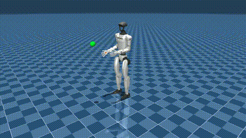

# VisionGuidedPolicy

PPO-based end-effector reaching for the Unitree G1 humanoid (29 DOF) in MuJoCo.
CS 5180 - Reinforcement Learning | Siddhesh Santosh Shingate



## Setup

```bash
pip install -r requirements.txt
python main.py --test   # smoke test
```

## Usage

```bash
# Train (GPU 1)
CUDA_VISIBLE_DEVICES=1 python main.py --train

# Resume
CUDA_VISIBLE_DEVICES=1 python main.py --train --resume checkpoints/ppo_g1_reach_v5_step500000.pt

# Eval
CUDA_VISIBLE_DEVICES=1 python main.py --eval --checkpoint checkpoints/ppo_g1_reach_v5_final.pt

# Watch
CUDA_VISIBLE_DEVICES=1 python main.py --watch --checkpoint checkpoints/ppo_g1_reach_v5_final.pt --speed 0.5

# Record
CUDA_VISIBLE_DEVICES=1 python main.py --record --checkpoint checkpoints/ppo_g1_reach_v5_final.pt --episodes 20
```

## Structure

```
config.py               # all hyperparameters
main.py                 # entry point
env/g1_reach_env.py     # MuJoCo environment
policy/actor_critic.py  # actor-critic MLP
training/ppo_trainer.py # PPO update loop
training/rollout_buffer.py
utils/logger.py
utils/transforms.py
utils/generate_plots.py
assets/g1/              # MJCF model + meshes
```

## Results

| Metric | Value |
|--------|-------|
| Peak success rate | 80% |
| Best EE distance | 8.4 cm |
| Training time | ~14 min |
| Throughput | 3,666 FPS (RTX 2080) |
